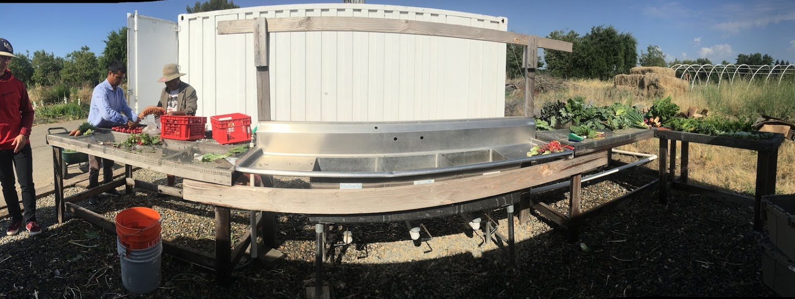
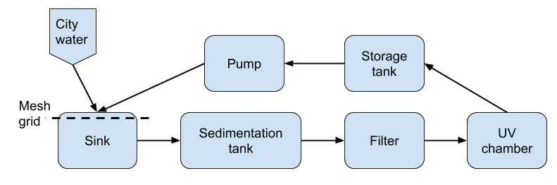
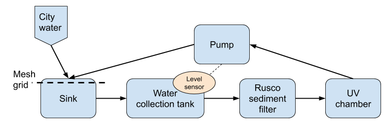
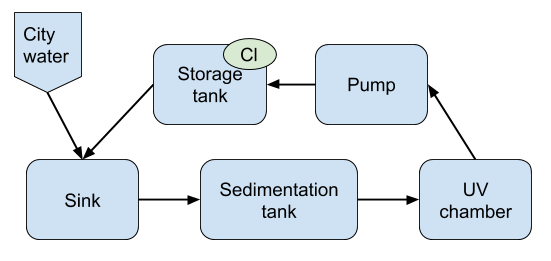
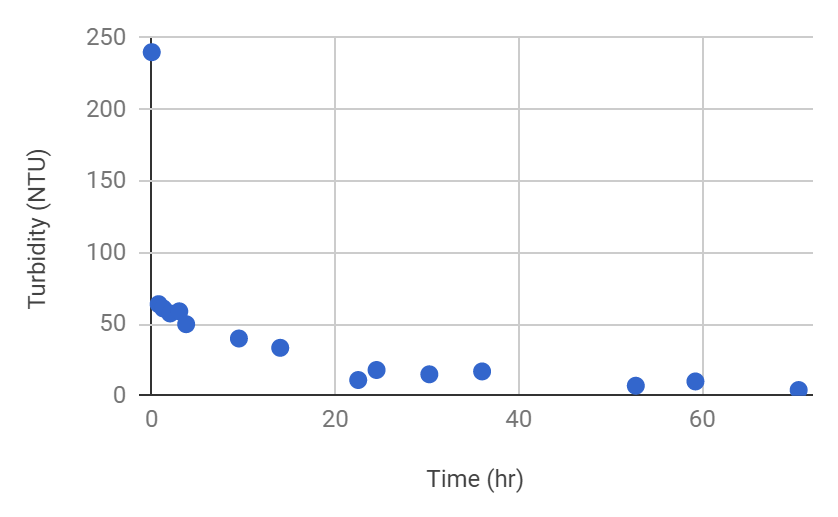
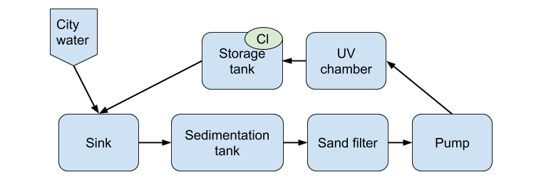
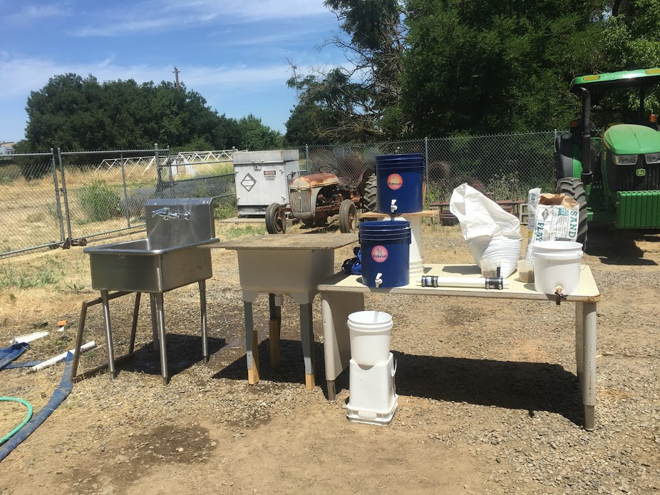

# Water Reuse System for Crop Wash Station
Apr-June 2019 
{: .text-right}

During my exchange programme at University of California Davis, I took a course involving **Product Design, Building, Testing**, offered by [UC Davis D-Lab](https://piet.ucdavis.edu/maindlab){:target="_blank" rel="noopener"}. In the course, I, along with 2 team members, designed and constructed a product prototype for a real client. Having gone through a complete protoytping process, I have gained understanding in different steps of a design process, and how to create a succesful product. 

## Our Client
Our team's client was a small farm in a nearby city. Initially, the water they used for washing crops would just be drain to the soil. They would like to build a water reuse system at their crop wash station, so that the crop wash water can be reused, reducing the amount of water consumption..

## Design Ideas
After brainstorming for different ideas, we used an Evaluative Matrix to decide the best way to reuse the crop water. We determined a few criterias for evaluation, then gave scores of 1 to 5 to each idea. Multiplying them with the weights of each criteria, we got a total score for each idea:

<table class="tg">
<thead>
  <tr>
    <th class="tg-fymr">Idea</th>
    <th class="tg-fymr">Performance: Food Safety</th>
    <th class="tg-fymr">Weight</th>
    <th class="tg-fymr">Initial Cost</th>
    <th class="tg-fymr">Weight</th>
    <th class="tg-fymr">Ease of Use</th>
    <th class="tg-fymr">Weight</th>
    <th class="tg-fymr">Performance: Amount of Water Reused</th>
    <th class="tg-fymr">Weight</th>
    <th class="tg-fymr">Learning Opportunity</th>
    <th class="tg-fymr">Weight</th>
    <th class="tg-fymr">Total</th>
  </tr>
</thead>
<tbody>
  <tr>
    <td class="tg-fymr">Crop Wash</td>
    <td class="tg-0pky">3</td>
    <td class="tg-0pky" rowspan="5">5</td>
    <td class="tg-0pky">2</td>
    <td class="tg-0pky" rowspan="5">4</td>
    <td class="tg-0pky">3</td>
    <td class="tg-0pky" rowspan="5">3</td>
    <td class="tg-0pky">5</td>
    <td class="tg-0pky" rowspan="5">4</td>
    <td class="tg-0pky">5</td>
    <td class="tg-0pky" rowspan="5">3</td>
    <td class="tg-0pky">67</td>
  </tr>
  <tr>
    <td class="tg-fymr">Drip Irrigation</td>
    <td class="tg-0pky">4</td>
    <td class="tg-0pky">2</td>
    <td class="tg-0pky">3</td>
    <td class="tg-0pky">5</td>
    <td class="tg-0pky">3</td>
    <td class="tg-0pky">66</td>
  </tr>
  <tr>
    <td class="tg-fymr">Furrow Irrigation</td>
    <td class="tg-0pky">4</td>
    <td class="tg-0pky">3</td>
    <td class="tg-0pky">3</td>
    <td class="tg-0pky">4</td>
    <td class="tg-0pky">4</td>
    <td class="tg-0pky">69</td>
  </tr>
  <tr>
    <td class="tg-fymr">Rain Garden</td>
    <td class="tg-0pky">5</td>
    <td class="tg-0pky">4</td>
    <td class="tg-0pky">5</td>
    <td class="tg-0pky">2</td>
    <td class="tg-0pky">3</td>
    <td class="tg-0pky">73</td>
  </tr>
  <tr>
    <td class="tg-fymr">Hand Wash</td>
    <td class="tg-0pky">3</td>
    <td class="tg-0pky">3</td>
    <td class="tg-0pky">3</td>
    <td class="tg-0pky">4</td>
    <td class="tg-0pky">5</td>
    <td class="tg-0pky">67</td>
  </tr>
</tbody>
</table>

Using the Evaluative Matrix, we decided that the best way to mitigate water usage was to deviate the used crop wash water to a rain garden. However, after presenting our result with our client, she preferred to repurpose the water back into the crop wash station instead of for irrigation or rain garden. 

## Design Criteria
After deciding on our design direction, we came up with considerations for our design, including technical, social, environmental, and financial considerations. 

We then made a Testing Table, to determine how to measure and test our prototype later.:

<table class="tg">
<thead>
  <tr>
    <th class="tg-fymr">Criteria</th>
    <th class="tg-fymr">Qualitative / Quantitative</th>
    <th class="tg-fymr">Testing Procedure</th>
    <th class="tg-fymr">Target Value</th>
    <th class="tg-fymr">Metric / Functional Unit</th>
    <th class="tg-fymr">Source</th>
  </tr>
</thead>
<tbody>
  <tr>
    <td class="tg-c3ow" colspan="6">Performance</td>
  </tr>
  <tr>
    <td class="tg-0pky">Water coliform level</td>
    <td class="tg-0pky">Quantitative</td>
    <td class="tg-0pky">Take a sample of the water after the purification process and test it for E. coli</td>
    <td class="tg-0pky">0</td>
    <td class="tg-0pky">colony forming units (cfu) per 100 mL</td>
    <td class="tg-0pky">United States Department of Agriculture</td>
  </tr>
  <tr>
    <td class="tg-0pky">Water turbidity</td>
    <td class="tg-0pky">Quantitative</td>
    <td class="tg-0pky">Take a sample of the water after the filtration process and test its turbidity</td>
    <td class="tg-0pky">&lt;5</td>
    <td class="tg-0pky">NTU (nephelometric turbidity unit)</td>
    <td class="tg-0pky">WHO</td>
  </tr>
  <tr>
    <td class="tg-0pky">The proportion of water reused</td>
    <td class="tg-0pky">Quantitative</td>
    <td class="tg-0pky">Measure the amount of water that is reused and divide it with the amount of water used for crop wash</td>
    <td class="tg-0pky">&gt;50</td>
    <td class="tg-0pky">%</td>
    <td class="tg-0pky">The water to be reused at least once</td>
  </tr>
  <tr>
    <td class="tg-c3ow" colspan="6">Economics</td>
  </tr>
  <tr>
    <td class="tg-0pky">Payback period</td>
    <td class="tg-0pky">Quantitative</td>
    <td class="tg-0pky">Calculate the time required for the accumulated money saved due to water saved to cover the cost required to produce and run the system</td>
    <td class="tg-0pky">&lt;2</td>
    <td class="tg-0pky">years</td>
    <td class="tg-0pky">Typical payback period</td>
  </tr>
  <tr>
    <td class="tg-0pky">Fabrication cost</td>
    <td class="tg-0pky">Quantitative</td>
    <td class="tg-0pky">Add up the cost of materials and labor for prototypes and the final product</td>
    <td class="tg-0pky">&lt;3000</td>
    <td class="tg-0pky">USD</td>
    <td class="tg-0pky">Amount of grant</td>
  </tr>
  <tr>
    <td class="tg-0pky">Operation and maintenance cost</td>
    <td class="tg-0pky">Quantitative</td>
    <td class="tg-0pky">Add up the cost of electricity required and components to be replaced per year</td>
    <td class="tg-0pky">&lt;200</td>
    <td class="tg-0pky">USD per year</td>
    <td class="tg-0pky">Client</td>
  </tr>
  <tr>
    <td class="tg-c3ow" colspan="6">Ergonomics</td>
  </tr>
  <tr>
    <td class="tg-0pky">Ease of use</td>
    <td class="tg-0pky">Qualitative</td>
    <td class="tg-0pky">Conduct a focus group of farm workers reporting on whether it is easy to use</td>
    <td class="tg-0pky">&gt;4</td>
    <td class="tg-0pky">People say it is easy to use on a scale of 1 to 5 (on average)</td>
    <td class="tg-0pky">Client</td>
  </tr>
  <tr>
    <td class="tg-0pky">Operation and maintenance</td>
    <td class="tg-0pky">Quantitative</td>
    <td class="tg-0pky">The time required for maintenance (e.g. changing the filter, clearing sediment in settlement tank)</td>
    <td class="tg-0pky">&lt;10</td>
    <td class="tg-0pky">Minutes per month</td>
    <td class="tg-0pky">Client</td>
  </tr>
</tbody>
</table>

## Site Visit
To better understand users' needs, we visited the client's farm on a day of when harvesting and crop wash occur. We documented the crop wash process and the design of crop wash station. Measurements, including the volume of water used in washing, the flow speeds, the turbidity of water after washing, etc. were also taken. Moreover, we consulted the farmers and learnt about other improvements they would like on the existing crop wash station. 
{:width="100%"}

## Prototype Designs and Testing
The design of the system evolved over the course as ideas were tested and experts were consulted. 

### Design 1
The initial design consisted of capturing the water and passing it through a sediment tank and filter system. This water would then pass through the UV tube, into a storage tank, into a pump, and then back to the system. 

{:width="70%"}

### Design 2
During a meeting our client, we decided to do a real-time reuse system so that the water after UV sanitization would not be contaminated during storage. 

Hoping to achieve a real-time system, the second iteration of the design removed the sedimentation tank as the settling time may be too long to ensure real-time reuse. A water collection tank is inserted after the sink, and a level sensor would trigger the start of the system when there is a certain amount of water. A sediment filter was found online, and thought to remove particles fast enough to allow the farmers immediate use of recycled water. The storage tank was also removed. 

{:width="70%"}

#### Testing of Sediment Filter
Crop wash water from the student farm was passed through the filter with a #100 mesh. We observed that the filter removed larger particles and bugs from the water but not the fine particles. This was concerning as the small particles had a very large influence on turbidity. The manufacturer provides mesh with smaller holes, which may remove the smaller particles. But they may get clogged up quickly and require frequent changing and maintenance.

### Design 3
The sediment filter used in Design #2 proved to be ineffective in removing the majority of particulates found in the water. As a result, a professor with expertise in wastewater treatment was consulted for advice on how to properly remove the small particulates. She suggested using sedimentation and maintained that a real-time system was not feasible because sedimentation takes a long time. 

Design #3 focused on a large sedimentation tank, to allow the particles to settle and for the clear water to be collected from the top. The storage tank was added and chlorine would be used to keep stored water from being contaminated. 

{:width="50%"}

#### Testing of Sedimentation Tank
We tried to recreate the farm’s crop wash water by adding soil collected from the farm into clear water, until the turbidity reaches the value measured during site visit. The turbidity of the water was then measured over 4 days by a [DIY turbidity tester](https://www.marineecologyfiji.com/wp-content/uploads/2014/07/Turbidity-Tube-making-Instructions.pdf){:target="_blank" rel="noopener"}. It was found that 3 days are required for the water to reach 5NTU, the turbidity required before entering sanitization according to the WHO. With this figure in mind, it was concluded that a real-time system may not be viable due to the time required to settle. 

The graph below shows the turbidity of water over 3 days. 
{:width="50%"}

### Design 4
The sediment tank prototype constructed for Design #3 proved to take too long for the water to settle to acceptable turbidity. 

Design #4 was changed to include a sand filter in addition to the sediment tank. The idea is to let the water settle for 1 day and then use the sand filter to remove the remainder of the sediment. The pump was moved to before the UV chamber, so we can control the flow rate into the UV chamber. 

{:width="70%"}

#### Testing of Sand Filter
A sand filter was constructed using a 5 gallon bucket with a spigot attached on the bottom. The bucket was filled with gravel (15% by volume) then sand (75% by volume). The remaining 10% of the bucket is left for water collection. 

The sand filter constructed and tested did not work as intended as the turbidity of the water did not significantly decrease after going through it. Pre-washed sand was used but it was found that the sand still contains a large amount of small particles. We tried to wash some of the sand, but a huge amount of water was required, defeating this project’s purpose of saving water. We should look for sand that is designed for water filtration (with absence of very fine particles). The first trial increased the turbidity of the water as the sand was not clean enough to remove contaminants and added its own. 

## Final Prototype
Due to a time restiction of only 2 months, we were not able to construct a working prototype. The picture below shows a prototype we built that illustrates different parts and sequence of the water reuse system we designed:

{:width="100%"}

The used crop wash water would go from left to right in the following sequence:
1. Silver sink: sink for crop wash
2. White sink: sedimentation tank 
3. Blue bucket at the bottom: sand filter 
4. White tube on table: UV chamber 
5. White bucket on the right: Storage tank

## Reference
If you want more details, feel free to contact me or refer to our full report accessible [here](https://piet.ucdavis.edu/dlab2018cropwash).
