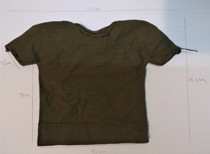
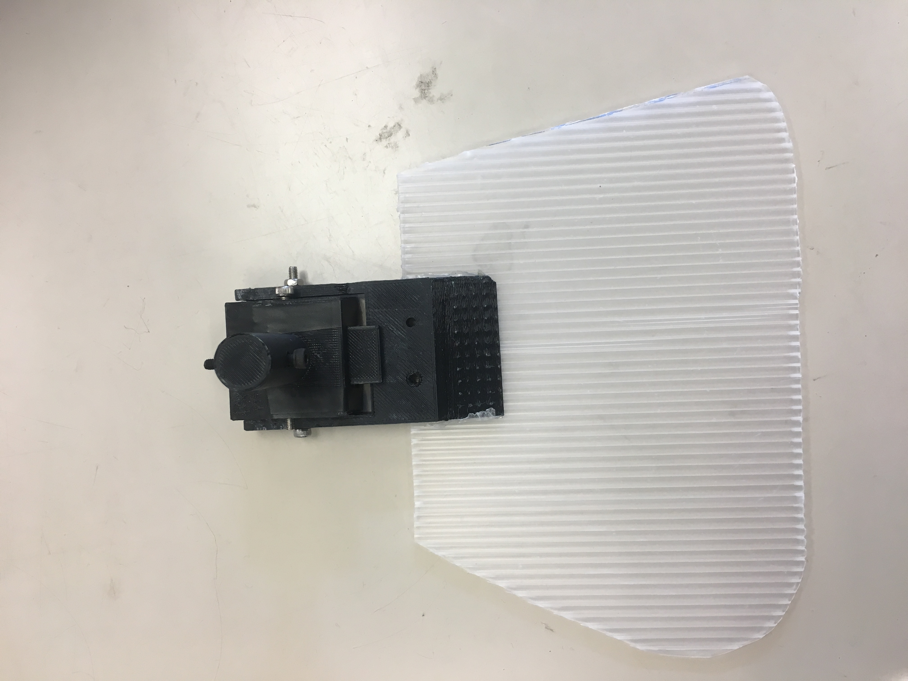
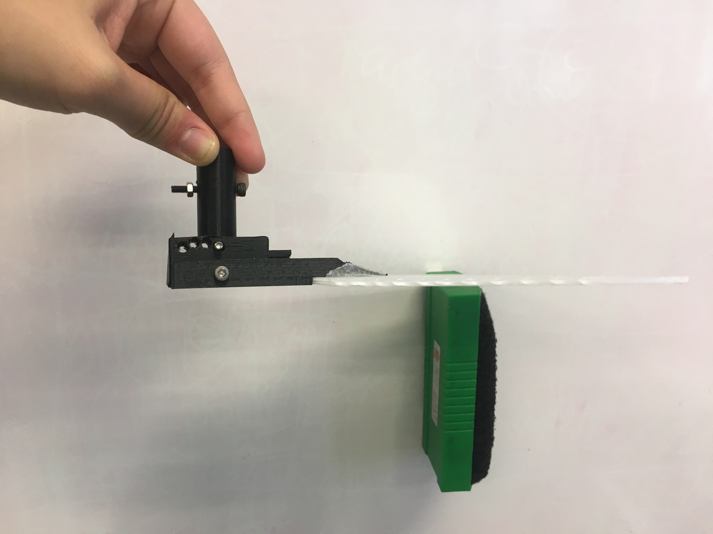
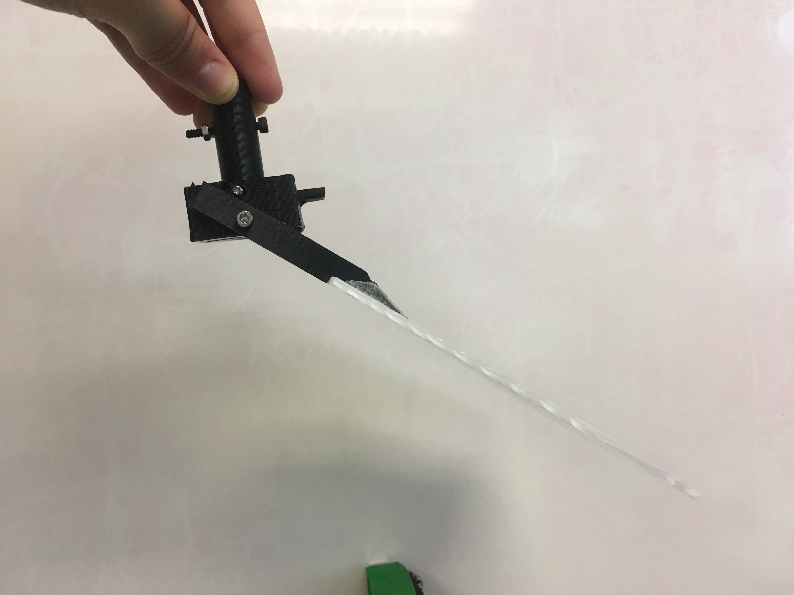
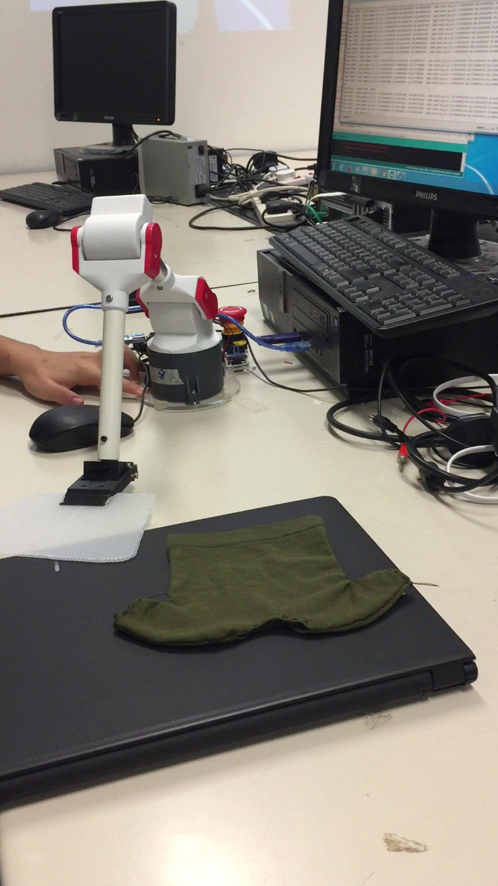

# Shirt-Folding Robot Arm
September-December 2018 
{: .text-right}

**Introduction to Robotics** is a hands-on course offered by CUHK Department of Mechanical and Automation Engineering. In the course, I learnt about motion planning, kinematics, and dynamics of robotic systems, with help of a real [robotic arm](http://www.cuhk.edu.hk/english/features/darwin-lau.html){:target="_blank" rel="noopener"}. We were also tasked to come up with and demonstrate an innovative idea for the use of the robotic arm, so that we could apply what we learnt in a practical scenario. 

## Idea
I, along with 2 team members, planned to use the robot arm to fold clothes. Since the power the robot arm's motor was not enough, we decided to do a demonstration using a mini-shirt.

{:width="100%" max-width="500px"}

## end effector
<!--
3d print
The end effector consists of two parts, the main body and a plank in trapezoid shape. They are connected by a revolute joint where the joint angle is fixed between 0 to -60 degree to the horizontal. This design is to make the plank parallel with the table when the plank is in process flipping the clothes. 
A flange is added in front of the main body to prevent the plank exceeding 0 degree. While for the -60 degree, it is held by inserting a screw. In fact we have different holes for several angles. 
The plank in trapezoid shape is for flipping the side of the clothes in a straight line. The angle of the trapezoid is calculated based on the size of the clothes and the distance between robot arm and the clothes. The plank can actually be replaced of different dimensions easily, so that different sizes of clothes can be folded. 
The final design of our end effector makes use of corrugated plastic board as our material. This material is lighter than plywood, alleviating the problem of insufficient servo power due to its heavy weight. With the adaption of corrugated plastic board, there is less resistance imposed to the robot arm so that shaking and tilting issue of the arm can be avoided when the motion are performed.
Considering the compatibility with the robot arm, we have cut our plank into smaller-sized so that it can be supported by the robot arm in a control manner. The smaller size of the plank also reduces air resistance when it flips over, reducing the torque required of the servo and contributing to the precision of the motion. 
-->

{:width="100%" max-width="500px"}

{:width="100%" max-width="500px"}

{:width="100%" max-width="500px"}

## trajectory planning
arduino, calibration, path planning, inverse kinematics, trajectory generation, trial and modification

<!--
1.	Path Planning
First, we need to plan the path of the end-effector. We need to decide where we use forward kinematics and where to use inverse kinematics. For example, when using the plank to fold the side of the shirt, controlling the joint angle maybe better than using inverse kinematics in order to ensure the plank remains parallel to the table surface. 
2.	Trajectory Generation
Secondly, we need to generate the trajectory and type the arduino code for it. We will be careful of the limitations, especially the total length available of the robot arm and the maximum angle rotation of joint 0. But still, it is possible to encounter this problem with an extended length of end effector. 
3.	Trial and Modification
Lastly, we need to try the code on the robot arm. We also need to change the different parameters like folding distance, time, etc. to ensure the robot arm can fold the shirt with accuracy and precision. One biggest problem is that the shirt will very likely to deform in a unwanted shape. To overcome this, we will try to modify the thickness of the plank as well as putting something relatively soft to the table under the clothes.
-->

<!--
The motion simply consists of two parts. First, the plank of the end effector will slide under the right half of the clothes and flip it over. Then, it will slide under the bottom half of the clothes and flip it over. With the performance of this two motions, the clothes will be fold in control manner.
The path of the end effector is designed in the task space and converted to angle command using inverse kinematics. We use cubic trajectory to produce a smoother motion.
Firstly, the end effector starts at the position to the right of the T-shirt (1). Secondly, the plank slides under the shirt for 5.5cm (2). Thirdly, all the servos are disabled so the end effector drops, and together with the edge all the platform, creates a flipping motion (3). Fourthly, the end effector is positioned at the bottom of the shirt. Fifthly, the end effector slides under the shirt for 7cm (5). Lastly, the end effector moves upward, flipping the shirt (6). 
Time (s)	x (mm)	  y (mm)	  z (mm)	
2~4	      120	      220	      40	      (1)
4~5	      120 → 65	220 → 320	40 → 30	  (2)
5~7	      65	      320	      30	
7~9	      /	        /	        /	        (3)
9~11	    0	        220	      45 → 30	  (4)
11~12	    0	        220 → 290	30	      (5)
12~14	    0	        290	      30	
14~15	    0	        290 → 310	30 → 2000	(6)
-->

## set up
<!--
The T-shirt is placed on a platform with height 3cm so that the slightly elevated plank can pass through the bottom of the clothes. The platform is about 20cm away from the base of the robot arm.
-->

{:width="100%" max-width="300px"}

<figure class="video_container">
  <iframe src="https://www.youtube.com/embed/pkln_JUA41Y" frameborder="0" allowfullscreen="true" style="width:100%; height:400px"> </iframe>
</figure>
