# Customised Table by Upcycling
August-September 2020 
{: .text-right}

Due to COVID-19, me and my family had to spend a lot more time working and studying at home. With limited working space in our house, my bed became my base of operation. It worked great for a while, until I realise my bad posture is giving me serious neck, back and wrist pain. This is the time when I am in desparate need of a table on my bed. 

And then one day, when I was passing through the rich neighbourhood near my home, I came across a bunch of wooden planks and a huge wood board someone tossed out to the streets. At that moment, I decided to upcycle these "waste" wood into a table (you should know by now, that I am an environmentalist and hate buying new things).

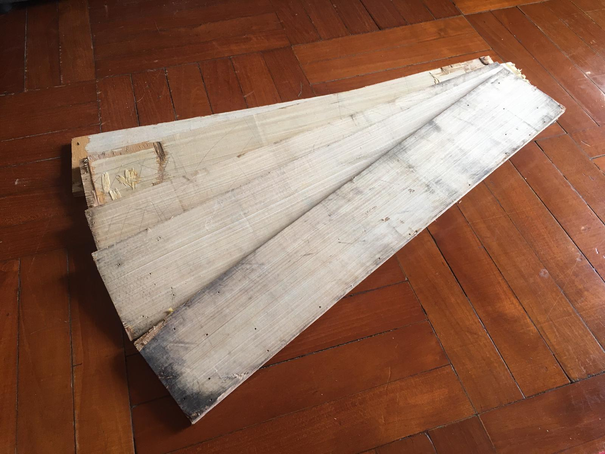{:width="70%"}

## Prototype 1

Since I didn't want my table to take up too much space, I decided to make a foldable table. Wanting to do some testings first, I only bought 2 hinges. At first, I didn't want to ruin the beautiful wood board until I am sure of the dimension I want. So I made the first prototype with a plastic panel (another thing I found on the street years ago), attaching it to the foldable frame with strings. 

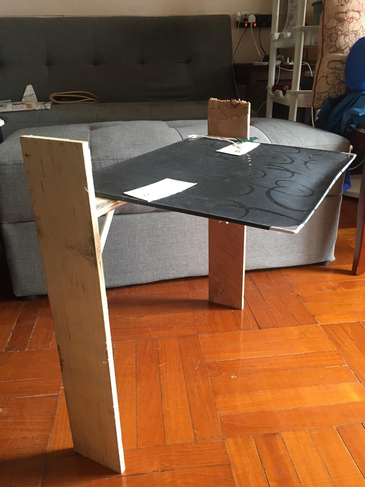{:width="40%"}
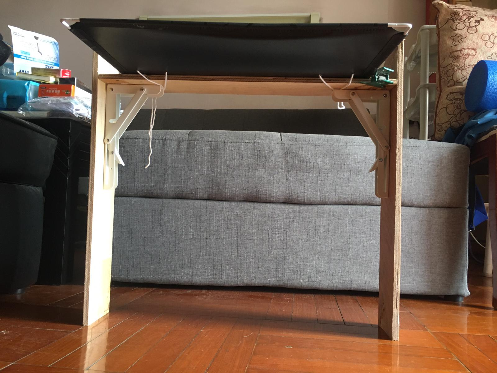{:width="40%"}

I used this 2-legged prototype for about a week, testing out whether the height is suitable for me and whether there is any problem with my design. And there is. 

It turned out the height of the legs was too long (compared to the width of the table), so they got into each other and could not be folded up properly. 

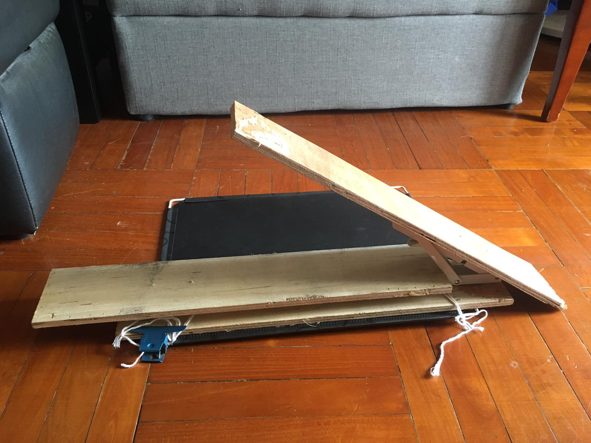{:width="70%"}

I also made an interesting discovery using the 2-legged table. I found that if I tilt the table, it actually provide a surface that's perfect for me to use my laptop. 

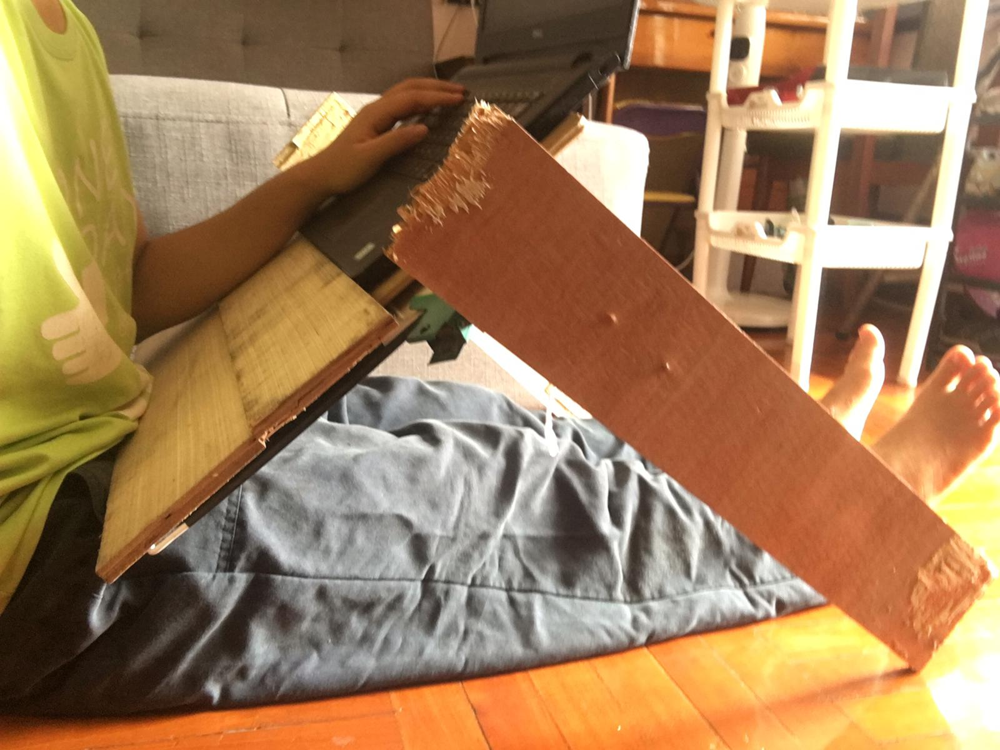{:width="70%"}

After putting 2 planks to elevate my laptop, it would be in a position where the monitor is at my eye level, while my hands can still type on the keyboard without my arms in a natural resting state. 

## Prototype 2

With the discoveries in mind, I proceeded with my second prototype. 

The height of the first protoype was fine, so I sawed off the excess length. 

I also decided to combine the other planks to form a table top, instead of using the huge wooden board, beacuase it was too heavy. Below shows a design draft for the table top. 

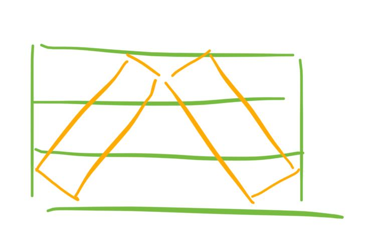{:width="70%"}

Since a proper fold-up would reqiure the legs to be non-symmetrical while a stable tilted position would require them to be symmetrical, I decided to make a compromise and have 2 legs foldable and 2 not. 

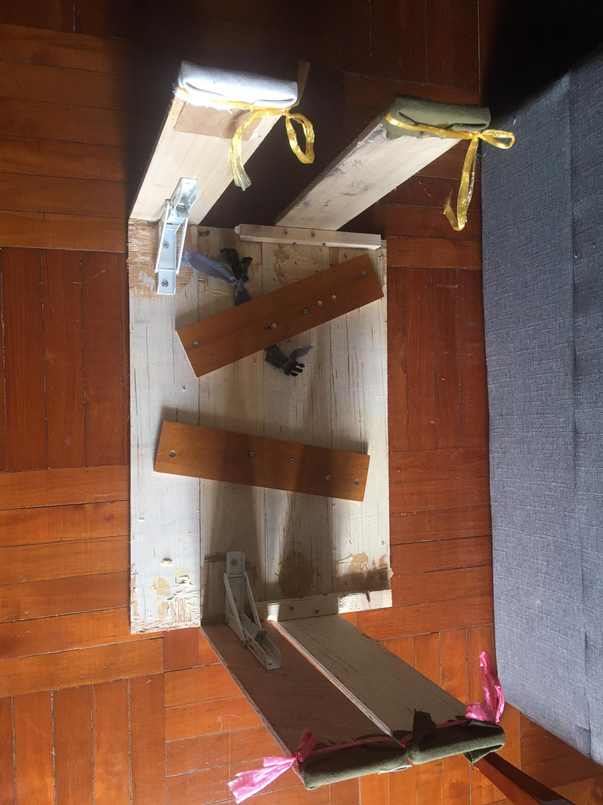{:width="70%"}

So here is how the second prototype looks (my laptop can even hold in place without additional planks for support!):

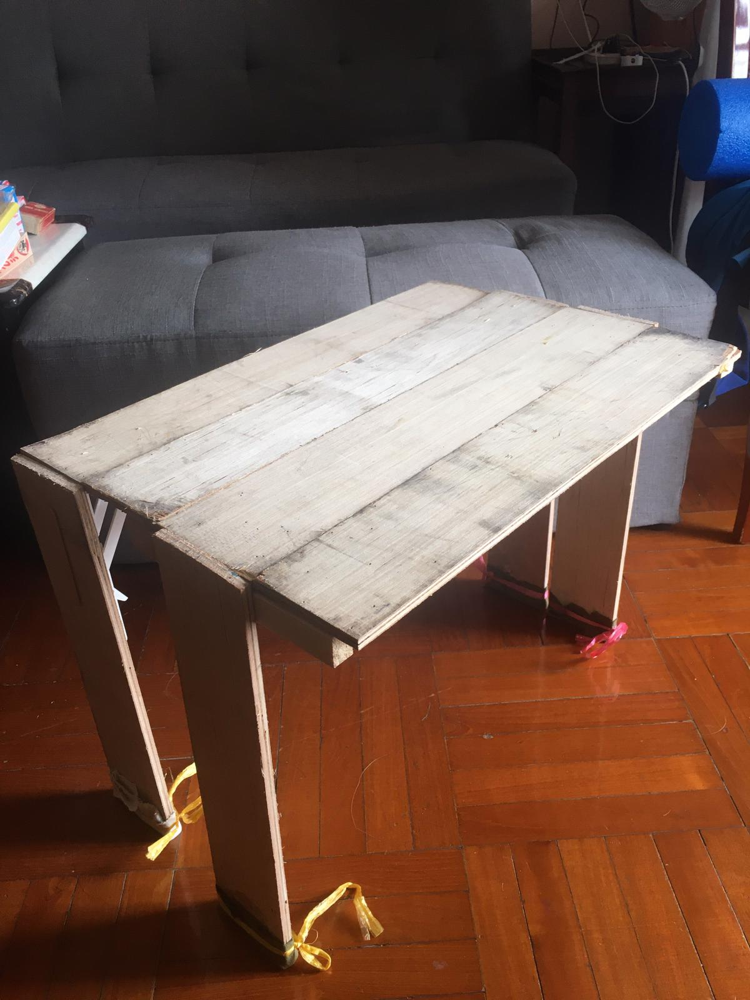{:width="70%"}
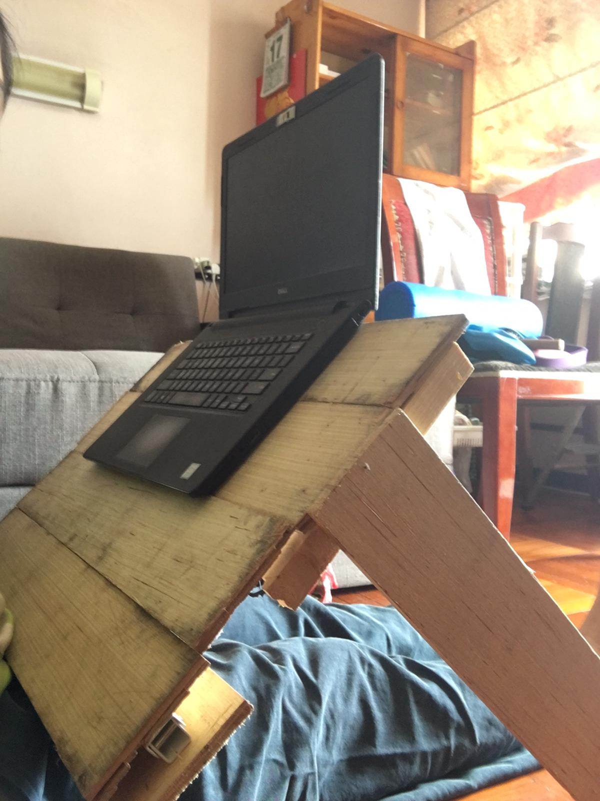{:width="70%"}

I also did some final touch-ups. Firstly, I wrapped the legs with some cloth, so that they do not scratch my bed sheet. Secondly, I added a clip to hold the leg in place when folded up. 

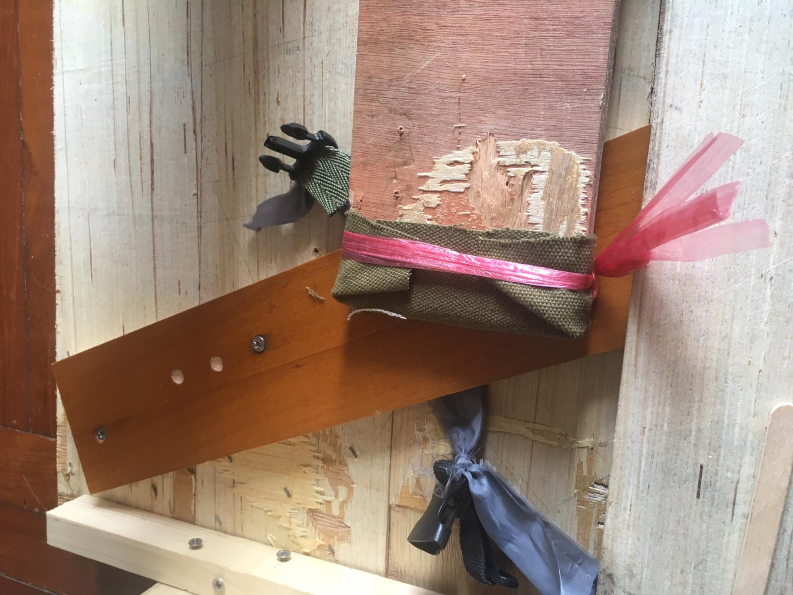{:width="40%"}
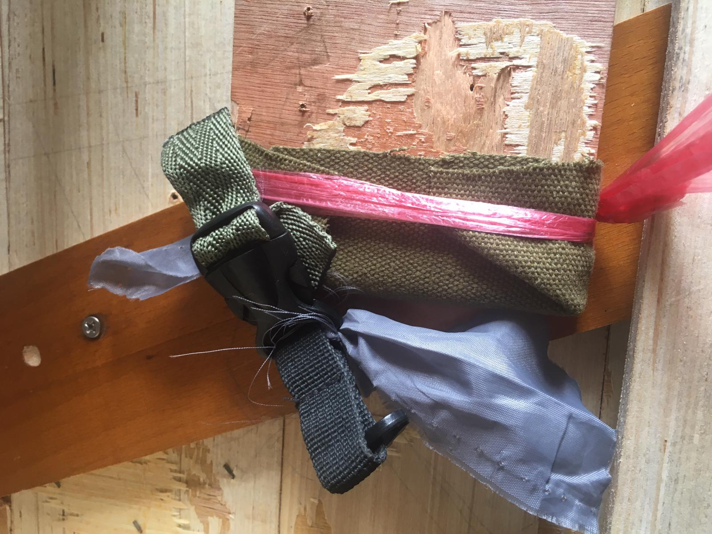{:width="40%"}

I know, it might not look as neat and beautiful as the ones you buy in stores. But to me, appearance does not matter. What matters is it works and will continue to work. Plus, it fits nicely on my bed. 

{:width="70%"}

So that's it, prototype 2 is the one I am using now. I will see if there is any problem with it and update you if a prototype 3 is required. 

